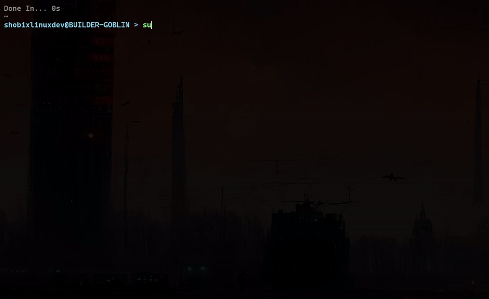
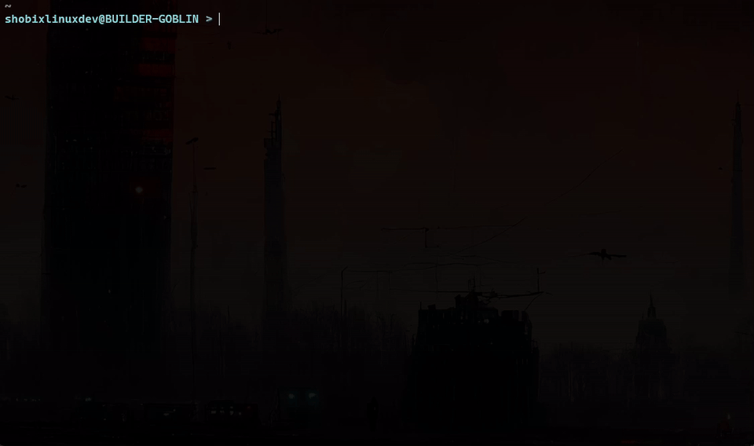
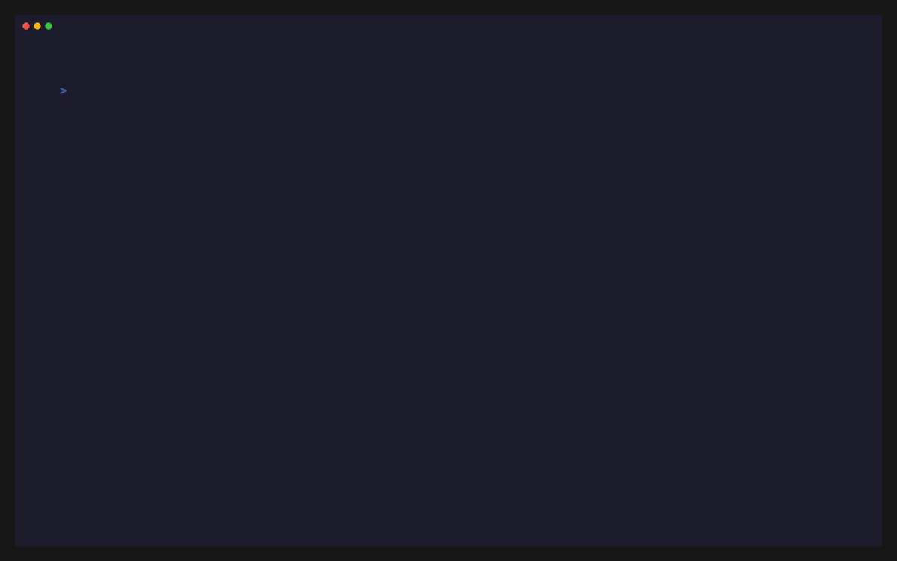
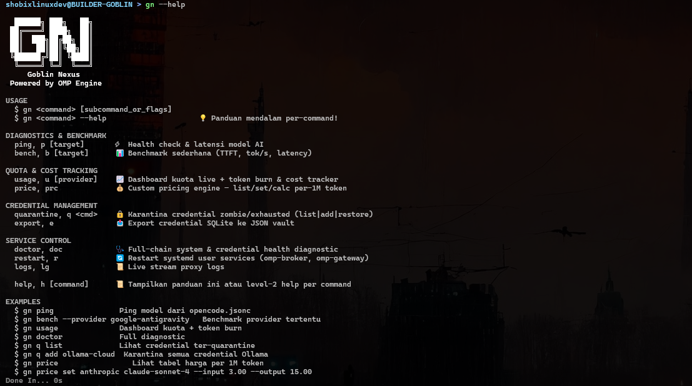

<p align="center">
  <br/>
  <code>
   ██████╗  ██████╗ ██████╗ ██╗     ██╗███╗   ██╗    ██╗   ██╗ █████╗ ██╗   ██╗██╗  ████████╗
  ██╔════╝ ██╔═══██╗██╔══██╗██║     ██║████╗  ██║    ██║   ██║██╔══██╗██║   ██║██║  ╚══██╔══╝
  ██║  ███╗██║   ██║██████╔╝██║     ██║██╔██╗ ██║    ██║   ██║███████║██║   ██║██║     ██║
  ██║   ██║██║   ██║██╔══██╗██║     ██║██║╚██╗██║    ╚██╗ ██╔╝██╔══██║██║   ██║██║     ██║
  ╚██████╔╝╚██████╔╝██████╔╝███████╗██║██║ ╚████║     ╚████╔╝ ██║  ██║╚██████╔╝███████╗██║
   ╚═════╝  ╚═════╝ ╚═════╝ ╚══════╝╚═╝╚═╝  ╚═══╝      ╚═══╝  ╚═╝  ╚═╝ ╚═════╝ ╚══════╝╚═╝
  </code>
  <br/><br/>
  <strong>Pusat Komando & Arsenal CLI/TUI untuk Terminal Enthusiast</strong>
  <br/><br/>
  <a href="https://github.com/CivilHQ/goblin-vault/actions/workflows/ci.yml">
    
  </a>
  
  
  
  <br/><br/>
  
  
  
  
  
  
</p>

---

> *Setiap hari kami menemukan friksi di terminal, setiap hari kami mengikisnya — sedikit demi sedikit — hingga tumpukan script acak ini berevolusi menjadi sebuah **Control Center** yang sesungguhnya.*

---

## Daftar Isi

- [Tentang](#-tentang)
- [Showcase](#-showcase)
- [The Arsenal](#%EF%B8%8F-the-arsenal)
- [Quickstart](#-quickstart)
- [Struktur Repositori](#-struktur-repositori)
- [Development](#-development)
- [Konvensi & Rules](#-konvensi--rules)
- [Komunitas & Kontribusi](#-komunitas--kontribusi)
- [Lisensi](#-lisensi)

---

## Tentang

**Goblin Vault** adalah pusat komando dan arsenal CLI/TUI utilities yang dibangun dari kebutuhan nyata seorang terminal builder. Bukan framework, bukan boilerplate — ini adalah **sistem operasional** yang mengikis friksi terminal satu per satu.

Filosofi inti:

- **Solve real friction** — Setiap tool lahir dari masalah yang benar-benar mengganggu workflow harian.
- **Terminal-first** — Semua interaksi terjadi di terminal. Tidak ada GUI, tidak ada browser dependency.
- **Modular & independent** — Setiap tool berdiri sendiri. Pakai satu, pakai semua — terserah.

---

## Showcase

<p align="center">
  
  <br/><em>sup — Granular multi-PM updater dengan interactive TUI</em>
</p>

<br/>

<p align="center">
  
  <br/><em>fex — File Explorer dengan fzf + tmux split integration</em>
</p>

<br/>

<p align="center">
  
  <br/><em>ocm — Dashboard & manager untuk konfigurasi OpenCode</em>
</p>

<br/>

<p align="center">
  
  <br/><em>zf — Zoxide & Tmux Rapid Navigation Helper</em>
</p>

<br/>

<p align="center">
  
  <br/><em>gn — AI adapter broker, benchmarking, & privacy shield</em>
</p>

---

## The Arsenal

| Tool | Deskripsi | Stack | Command |
|:-----|:----------|:------|:--------|
| **[`sup`](tools-cli/src/sup/)** `v1.1.0` | Smart Universal Package Updater — granular multi-select updater untuk NPM, PIP3, System, Rustup, Bun, OMP. Mode verbose streaming (`-v`), proactive sudo handling. | TypeScript, Bun, Clack TUI | `sup` |
| **[`fex`](tools-cli/src/fex/)** | File Explorer TUI — navigasi super cepat dengan fzf + tmux split mode. Subcommand: `tree`, `search`, `create`, `editor`, `path`, `kill`. Bookmark & state-machine navigation. | Go 1.22, Cobra, fzf, tmux | `fex` |
| **[`gn`](tools-cli/src/gn/)** | Goblin Nexus CLI — Control Center core, AI adapter broker, bench tools, price/telemetry tracking, quarantine & privacy shield daemon. | Shell, TypeScript, Bun | `gn` |
| **[`ocm`](tools-cli/src/ocm/)** `v1.2.0` | OpenCode Configurator TUI — dashboard & manager untuk opencode config, agents, MCP servers, dan providers. | TypeScript, Bun, Clack TUI | `ocm` |
| **[`zf`](tools-cli/src/zf/)** | Zoxide & Tmux Helper — rapid directory navigation, session switcher, auto-launcher tools integration. | Pure Shell (Zsh) | `zf` |
| **[`gh-blin`](tools-cli/src/gh-blin/)** `v1.0.0` | GitHub Assistant TUI — kelola Issue, PR, Auth, & Release GitHub langsung dari terminal. | Node.js, Clack TUI | `gh-blin` |

---

## Quickstart

### Prasyarat

| Dependency | Versi Minimum | Cek |
|:-----------|:--------------|:----|
| **Node.js** | `>= 20` | `node -v` |
| **Bun** | `>= 1.0` | `bun -v` |
| **Go** | `>= 1.22` | `go version` |
| **fzf** | latest | `fzf --version` |
| **tmux** | latest | `tmux -V` |
| **zoxide** | latest | `zoxide --version` |
| **gh** (GitHub CLI) | latest | `gh --version` |

### Instalasi

```bash
# 1. Clone repositori
git clone https://github.com/CivilHQ/goblin-vault.git
cd goblin-vault

# 2. Tambahkan bin/ ke PATH (di ~/.zshrc atau ~/.bashrc)
export PATH="$PATH:$(pwd)/tools-cli/bin"

# 3. Install git hooks
bash scripts/install-hooks.sh

# 4. Build fex (Go binary)
cd tools-cli/src/fex && go build -o ~/.local/bin/fex .
cd -

# 5. Install dependencies sup & gh-blin
cd tools-cli/src/sup && bun install && bun run build
cd -
cd tools-cli/src/gh-blin && bun install
cd -

# 6. Deploy config editor (micro & nvim)
bash scripts/install.sh

# 7. Health check — pastikan semua dependency terdeteksi
bash scripts/doctor.sh
```

### Verifikasi

```bash
sup --help       # Package updater TUI
fex --help       # File explorer TUI
gn --help        # Goblin Nexus CLI
ocm --help       # OpenCode configurator
zf --help        # Zoxide navigation
gh-blin --help   # GitHub assistant
```

---

## Struktur Repositori

```
goblin-vault/
├── tools-cli/                  # Pusat persenjataan CLI
│   ├── bin/                    # Executable wrappers (sup, fex, gn, ocm, zf, gh-blin)
│   └── src/                    # Source code per-tool
│       ├── fex/                # File Explorer (Go + Cobra)
│       ├── gn/                 # Goblin Nexus CLI (Shell + TypeScript)
│       ├── gh-blin/            # GitHub Assistant TUI (Node.js)
│       ├── goblin-control/     # Control Center core (Node.js)
│       ├── ocm/                # OpenCode Configurator (TypeScript)
│       ├── sup/                # Smart Package Updater (TypeScript + Bun)
│       ├── zf/                 # Zoxide & Tmux Helper (Shell)
│       └── shield/             # Privacy Shield Interceptor (TypeScript)
├── scripts/                    # Utilities & automation
│   ├── check_syntax.sh         # Linter untuk Bash, Go, JS, TS
│   ├── doctor.sh               # Health & dependency checker
│   ├── install.sh              # Setup PATH & symlink config
│   ├── install-hooks.sh        # Install git hooks
│   ├── release.sh              # SemVer release engine
│   └── worktree.sh             # Git worktree manager
├── configs/                    # Config editor (micro, nvim)
├── docs/                       # Dokumentasi, rules, changelog
│   ├── CHANGELOG/              # Changelog modular per-tool
│   └── rules/                  # Coding style & operational rules
├── .github/                    # CI workflows + git hooks
├── AGENTS.md                   # Panduan agent & kontributor
├── CHANGELOG.md                # Master changelog
├── CONTRIBUTING.md             # Panduan kontribusi
├── CODE_OF_CONDUCT.md          # Code of conduct
└── LICENSE                     # MIT License
```

---

## Development

### Git Hooks (lokal)

```bash
bash scripts/install-hooks.sh
```

- **pre-commit** — menjalankan `check_syntax.sh --staged` (fast, hanya file yang di-stage).
- **pre-push** — menjalankan `check_syntax.sh` full scan + build `fex`.

### CI (GitHub Actions)

Setiap push/PR ke `main` atau `dev` memicu pipeline:
- Lint & syntax check seluruh codebase
- Build `fex` binary dari source
- Validasi dependencies & types

### Health Check

```bash
bash scripts/doctor.sh          # Dependency & PATH check
bash scripts/check_syntax.sh    # Lint Bash, Go, JS, TS
```

### Release

```bash
# Release versi global vault
./scripts/release.sh vault patch    # atau minor / major

# Release per-tool
./scripts/release.sh fex patch
./scripts/release.sh sup minor
```

---

## Konvensi & Rules

| Dokumen | Isi |
|:--------|:----|
| [`AGENTS.md`](AGENTS.md) | Struktur repo, guideline engineering, coding standards, do/don't |
| [`docs/rules/coding-style.md`](docs/rules/coding-style.md) | Immutability, file organization, error handling, input validation |
| [`CHANGELOG.md`](CHANGELOG.md) | Master changelog + navigasi ke changelog per-tool |
| [`docs/CHANGELOG/`](docs/CHANGELOG/) | Detail changelog per-tool (`sup.md`, `fex.md`, `gn.md`, `ocm.md`, `zf.md`, `gh-blin.md`) |

**Highlights:**
- Bahasa dokumentasi: **Indonesia** (utama), English untuk istilah teknis.
- Immutable data pattern sebagai default.
- File kecil & fokus (200-400 baris ideal, 800 baris maks).
- Error handling eksplisit — tidak boleh silent swallow.
- Shell script state-changing wajib `set -euo pipefail`.

---

## Komunitas & Kontribusi

Kami terbuka untuk kontribusi! Sebelum mulai, baca dokumen berikut:

| Dokumen | Deskripsi |
|:--------|:----------|
| [`CONTRIBUTING.md`](CONTRIBUTING.md) | Panduan lengkap cara berkontribusi, workflow PR, dan checklist |
| [`CODE_OF_CONDUCT.md`](CODE_OF_CONDUCT.md) | Standar perilaku & nilai komunitas |
| [`SECURITY.md`](.github/SECURITY.md) | Kebijakan & pelaporan celah keamanan privat |
| [`AGENTS.md`](AGENTS.md) | Panduan khusus untuk AI agent & kontributor otomatis |

**Checklist sebelum PR:**

```bash
bash scripts/doctor.sh            # Dependency & PATH check
bash scripts/check_syntax.sh      # Lint seluruh codebase
cd tools-cli/src/fex && go build -o ~/.local/bin/fex .  # Build fex
```

---

## Lisensi

Dirilis di bawah [MIT License](LICENSE).

```
Copyright (c) 2026 Goblin Builder
```

---

<p align="center">
  <br/>
  <strong>Dibuat oleh Goblin, dirawat oleh Goblin, untuk kedamaian terminal Goblin.</strong>
  <br/>
  🍻👹
  <br/><br/>
</p>
