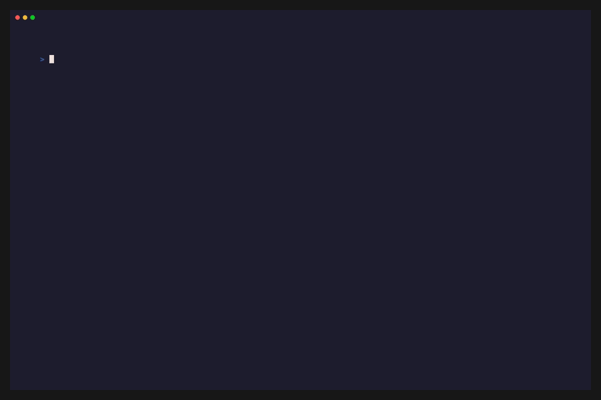
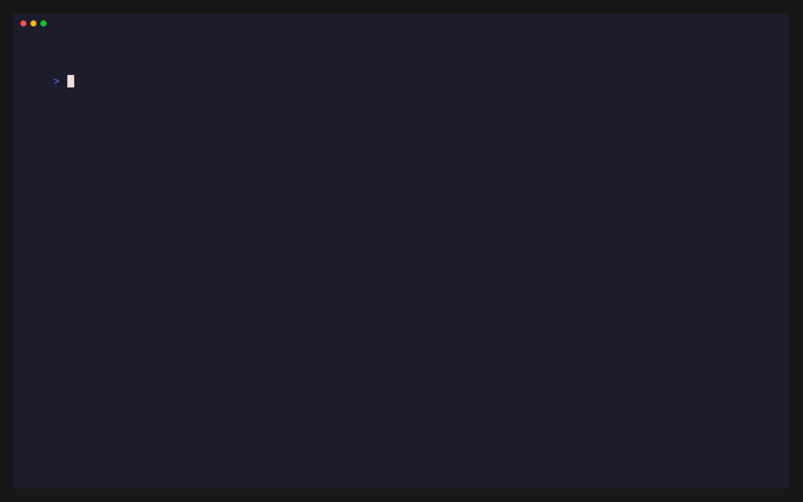

<p align="center">
  <br/>
  
  <br/><br/>
  <strong>Pusat Komando & Arsenal CLI/TUI untuk Terminal Enthusiast</strong>
  <br/><br/>
  <a href="https://github.com/amadshobi/goblin-vault/actions/workflows/ci.yml">
    
  </a>
  
  
  
  <br/><br/>
  
  
  
  
  
  
</p>

---

> _Setiap hari kami menemukan friksi di terminal, setiap hari kami mengikisnya — sedikit demi sedikit — hingga tumpukan script acak ini berevolusi menjadi sebuah **Control Center** yang sesungguhnya._

---

## Daftar Isi

- [Tentang](#-tentang)
- [Showcase](#-showcase)
- [The Arsenal](#%EF%B8%8F-the-arsenal)
- [Lego Ecosystem Matrix](#-lego-ecosystem-matrix)
- [Master Configs (Neovim & Micro)](#-master-configs)
- [Quickstart & Automated Installer](#-quickstart--automated-installer)
- [Struktur Repositori](#-struktur-repositori)
- [Development & Quality Gates](#-development--quality-gates)
- [Lisensi](#-lisensi)

---

## 📖 Tentang

**Goblin Vault** adalah pusat komando dan arsenal CLI/TUI utilities yang dibangun dari kebutuhan nyata seorang terminal builder. Bukan sekadar framework atau dotfiles biasa — ini adalah **sistem operasional** yang mengikis friksi terminal satu per satu.

Filosofi inti:

- **Solve Real Friction** — Setiap tool lahir dari masalah yang benar-benar mengganggu alur kerja harian.
- **Terminal-First & Snappy** — Semua interaksi berjalan instan di terminal dengan visual responsif tanpa ketergantungan browser.
- **Modular & Independent** — Setiap tool berdiri sendiri namun tersinkronisasi mulus sebagai satu kesatuan suite.

---

## 🎬 Showcase

<p align="center">
  
  <br/><em><b>fex</b> — Instant Tree / Flat Find mode, streaming Ripgrep, context Git viewer, dan interactive clipboard</em>
</p>

<br/>

<p align="center">
  
  <br/><em><b>gn</b> — AI Telemetry Plane, Speed Leaderboard (`gn bench`), Connectivity Probe (`gn ping`), dan Token Tree</em>
</p>

<br/>

<p align="center">
  
  <br/><em><b>gb</b> — GitHub Assistant TUI untuk Issue, Pull Requests, Releases, dan GitHub App Bot Manager</em>
</p>

<br/>

<p align="center">
  
  <br/><em><b>sup</b> — Granular multi-package updater (NPM, PIP, System, Bun, Rustup, OMP) dengan interactive TUI</em>
</p>

<br/>

<p align="center">
  
  <br/><em><b>zf</b> — Rapid directory navigation, auto-launcher tools, dan session manager</em>
</p>

---

## ⚔️ The Arsenal

| Tool                            |   Versi   | Deskripsi                                                                                                                                                                                                                                             | Stack                     | Command |
| :------------------------------ | :-------: | :---------------------------------------------------------------------------------------------------------------------------------------------------------------------------------------------------------------------------------------------------- | :------------------------ | :------ |
| **[`pm`](tools-cli/src/pm/)**   | `v0.1.0`  | **Universal Package & Registry Manager** — Split-pane TUI (Updates, Live Multi-Registry Search & Install, Installed Packages) lintas 10 ekosistem (APT, Snap, Flatpak, Bun, OMP, Rustup, Brew, PIP, NPM, Cargo) dengan in-memory safe Sudo.           | Rust 2024, Ratatui, Tokio | `pm`    |
| **[`fex`](tools-cli/src/fex/)** | `v0.3.16` | **File Explorer TUI** — Tree Mode (`🌳`), Flat Find (`🔍`), Instant mode switcher (`Tab`), Interactive Clipboard (`Alt-c`/`Alt-m`/`Alt-v`), Context-Aware Git viewer/lazygit (`Ctrl-g`), OSC 52 System Clipboard (`Ctrl-y`), dan Dynamic Keybindings. | Go 1.22, Cobra, fzf, tmux | `fex`   |
| **[`gn`](tools-cli/src/gn/)**   | `v2.1.0`  | **Control Center & AI Telemetry Plane** — `omp usage` forwarding, multi-day token activity tree (`-t`), file diffs audit (`-f`), connectivity probe (`ping`), speed leaderboard (`bench`), Zero-Secret Auth Matrix doctor, dan Smart Gateway Interceptor (`gw`). | TypeScript, Bun           | `gn`    |
| **[`gb`](tools-cli/src/gb/)**   | `v2.2.0`  | **GitHub Assistant TUI** — Manajemen Issue, PR Reviews, Profile Editor, Releases, dan GitHub App Bot automation (`status`, `token`, `comment`, `config`) via RS256 JWT & hybrid credentials.                                                          | Node.js, Clack TUI, gh    | `gb`    |
| **[`sup`](tools-cli/src/sup/)** | `v1.1.0`  | **Universal Granular Package Updater** — Backward-compatible shim yang mendelegasikan perintah update ke engine native `pm update` secara transparan.                                                                                                 | Rust / Shell Shim         | `sup`   |
| **[`zf`](tools-cli/src/zf/)**   | `v0.2.0`  | **Zoxide & Tmux Rapid Engine** — Lompat ke direktori proyek dalam hitungan milidetik, auto-switch tmux session, dan integrasi launcher fex.                                                                                                           | Pure Shell (Zsh / Bash)   | `zf`    |

---

## 🧱 Lego Ecosystem Matrix

Goblin Vault mengorkestrasi alat-alat CLI modern terbaik menjadi satu ekosistem yang utuh:

| Tier       | Tool Driver         | Fitur yang Di-Unlock di Goblin Vault                       | Status Fallback                |
| :--------- | :------------------ | :--------------------------------------------------------- | :----------------------------- |
| **Tier 1** | `fzf`               | Fuzzy selector engine untuk `fex`, `zf`, dan popup dialogs | Required                       |
| **Tier 1** | `tmux`              | Multiplexer & right split preview pane driver              | Required                       |
| **Tier 1** | `zoxide`            | Smart directory tracking engine untuk `zf`                 | Required                       |
| **Tier 1** | `bun` / `node`      | Runtime eksekusi TypeScript untuk `gn`, `sup`, `gb`        | Required                       |
| **Tier 2** | `lazygit`           | Full Git Manager TUI di `fex` (`Ctrl-g` di folder)         | In-TUI File Git History viewer |
| **Tier 2** | `ripgrep` (`rg`)    | Streaming Live Content Search di `fex` (`Ctrl-f`)          | Standard file search           |
| **Tier 2** | `bat` / `batcat`    | Syntax highlight preview code di `fex`                     | `cat -n`                       |
| **Tier 2** | `eza` / `tree`      | Modern colored tree & directory icon preview di `fex`      | `ls -1p`                       |
| **Tier 2** | `fd` / `fdfind`     | Ultra-fast recursive directory scanner di `fex`            | Go Native File Walker          |
| **Tier 2** | `xclip` / `wl-copy` | Native OS clipboard provider di `fex`                      | ANSI OSC 52 Escape Sequences   |

---

## ⚙️ Master Configs

Goblin Vault menyertakan master template konfigurasi siap pakai:

- **[`configs/nvim/`](configs/nvim/)** — Master Neovim (LazyVim) **by amadshobi**: Menggabungkan kenyamanan navigasi Micro/VS Code (`Ctrl-S` save, `Ctrl-Z` undo, `Ctrl-X` quit, `whichwrap`), kecepatan autocompletion **Blink.cmp**, floating terminal **Snacks.nvim** (`<F4>` / `<Alt-t>`), dan OpenCode JSON schema validator.
- **[`configs/fex/`](configs/fex/)** — Master runtime config `fex` dengan customizable keybindings.
- **[`configs/micro/`](configs/micro/)** — Master micro editor config dengan Darcula Glass theme dan custom filemanager plugin.

Sinkronisasi config dapat dilakukan kapan saja via:

```bash
fex backup all     # Backup: ~/.config/ → goblin-vault/configs/
fex restore all    # Restore: goblin-vault/configs/ → ~/.config/
```

---

## 🚀 Quickstart & Automated Installer

Instalasi seluruh suite, konfigurasi PATH, kompilasi binary, dan pembuatan symlink universal dapat dilakukan instan via **cURL** atau eksekusi lokal:

### 1. Instant 1-Line Remote cURL Installation

```bash
curl -fsSL https://raw.githubusercontent.com/amadshobi/goblin-vault/main/scripts/install.sh | bash
```

### 2. Manual Git Clone & Installation

```bash
git clone https://github.com/amadshobi/goblin-vault.git ~/civil/goblin-vault
cd ~/civil/goblin-vault
./scripts/install.sh
```

Installer otomatis menyajikan **Dynamic Braille Spinner**, mengompilasi binary Go `fex`, menginstall dependensi TypeScript `gn`, `gb`, `sup`, membuat symlink di `~/.local/bin/`, mendeploy config, dan menawarkan instalasi Lego Power-Ups (`[y/N]` prompt).

### 3. Modular Installation

```bash
./scripts/install.sh fex       # Khusus build & link fex
./scripts/install.sh gn        # Khusus setup Goblin Nexus
./scripts/install.sh gb        # Khusus setup GitHub Assistant
./scripts/install.sh sup       # Khusus setup Package Updater
./scripts/install.sh zf        # Khusus link Zoxide engine
./scripts/install.sh config    # Khusus deploy config micro, fex, nvim
./scripts/install.sh lego      # Khusus scan & pasang Lego Power-Ups
./scripts/install.sh --yes     # Mode non-interaktif (CI/Docker)
```

### 4. Diagnostic Health Check

Periksa kesehatan seluruh tool dan dependensi kapan saja dengan:

```bash
./scripts/doctor.js
```

---

## 📁 Struktur Repositori

```text
goblin-vault/
├── tools-cli/                  # Pusat persenjataan CLI
│   ├── bin/                    # Executable binaries/wrappers (fex, gb, gn, sup, zf)
│   └── src/                    # Source code per-tool
│       ├── fex/                # File Explorer (Go + Cobra + FZF)
│       ├── gn/                 # Goblin Nexus CLI (TypeScript + Bun)
│       ├── gb/                 # GitHub Assistant TUI (Node.js + Clack)
│       ├── sup/                # Smart Package Updater (TypeScript + Bun)
│       └── zf/                 # Zoxide & Tmux Helper (Zsh / Bash)
├── configs/                    # Master configuration templates
│   ├── fex/                    # Master fex runtime YAML config
│   ├── micro/                  # Master micro editor setup
│   └── nvim/                   # Master LazyVim setup (by amadshobi)
├── scripts/                    # Utilities & automations
│   ├── check_syntax.js         # Linter & Security Engine (Bash, Go, JS, TS)
│   ├── doctor.js               # Health & Lego matrix diagnostic engine
│   ├── install.sh              # Modern All-in-One Installer & Integrator
│   ├── install-hooks.sh        # Git hooks installer (pre-commit & pre-push)
│   ├── release.sh              # Automated SemVer release & GitHub publisher
│   └── worktree.sh             # Git worktree manager
├── docs/                       # Dokumentasi, rules, changelog, dan assets
│   ├── CHANGELOG/              # Changelog modular per-tool (fex, gn, gb, sup, zf)
│   ├── vhs/                    # Charmbracelet VHS tape automation scripts
│   └── assets/                 # SVGs, screenshots, dan GIF showcase
├── AGENTS.md                   # Panduan engineering agent & kontributor
├── CHANGELOG.md                # Master macro changelog
└── README.md                   # Dokumentasi publik utama
```

---

## 🛡️ Development & Quality Gates

Repositori ini menerapkan standar rekayasa perangkat lunak ketat yang dijaga oleh Git hooks dan CI:

- **Syntax & Security Scan**:
  - `./scripts/check_syntax.js --staged` (`-s`) — Fast scan khusus file yang di-stage.
  - `./scripts/check_syntax.js --full` (`-f`) — Full workspace scan untuk Bash, Go, JS, TS, dan permissions.
- **Git Hooks Pipeline**:
  - `pre-commit`: Menjalankan syntax checker pada file staged.
  - `pre-push`: Menjalankan full health check (`doctor.js`), kompilasi Go `fex`, dan full syntax linter sebelum push diizinkan.

---

## 📜 Lisensi

Didistribusikan di bawah lisensi [MIT](LICENSE). Dibuat dengan penuh dedikasi oleh [amadshobi](https://github.com/amadshobi) untuk para pejuang terminal. 🍻👹
