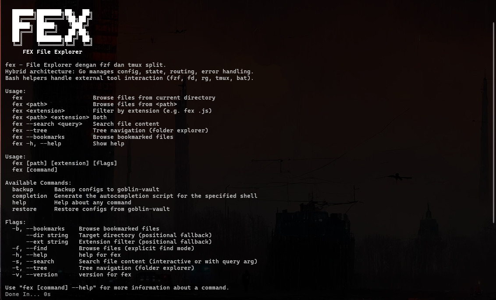

<p align="center">
  <br/>
  <code>
    ██████╗ ██╗  ██╗    ██████╗ ██╗     ██╗███╗   ██╗
   ██╔════╝ ██║  ██║    ██╔══██╗██║     ██║████╗  ██║
   ██║  ███╗███████║    ██████╔╝██║     ██║██╔██╗ ██║
   ██║   ██║██╔══██║    ██╔══██╗██║     ██║██║╚██╗██║
   ╚██████╔╝██║  ██║    ██████╔╝███████╗██║██║ ╚████║
    ╚═════╝ ╚═╝  ╚═╝    ╚═════╝ ╚══════╝╚═╝╚═╝  ╚═══╝
  </code>
  <br/><br/>
  <strong>GitHub Assistant TUI v1.0.0</strong>
  <br/><br/>
  
  
  
  
  <br/><br/>
  
  <br/>
</p>

# gh-blin — GitHub Assistant TUI `v1.0.0`

> **TUI GitHub Client** — Pengelola interaktif berbasis terminal untuk Pull Request, Issues, Releases, dan autentikasi GitHub.

---

## 🧠 Deskripsi Singkat

**gh-blin** adalah antarmuka terminal interaktif (TUI) berbasis Node.js yang membungkus command-line interface GitHub resmi (`gh`). Menggunakan Clack TUI, `gh-blin` mengotomatiskan pengelolaan alur kerja harian (issues, pull requests, release tagging, auth status) tanpa perlu mengetik parameter CLI yang panjang atau membuka web browser.

---

## 🚀 Fitur Utama & Menu Navigasi

- 🔀 **Pull Requests Manager (`pr`)**: Melihat daftar PR aktif, membuat PR baru, memeriksa status CI checks, serta melakukan merge PR langsung dari terminal.
- 🐛 **Issues Manager (`issues`)**: Menjelajah daftar issue terbuka/tertutup, membuat issue baru, serta menambahkan komentar/status pada issue terpilih.
- 📦 **Releases Manager (`releases`)**: Membuat release tag baru, melampirkan release notes, dan mempublikasikan release draft ke GitHub.
- 📂 **Repo Explorer (`repos`)**: Navigasi daftar repositori lokal/remote, menampilkan detail informasi repo (`repoInfo`), serta pintasan cepat untuk membuka repository di browser (`openRepo`).
- 🔐 **Auth Assistant (`auth`)**: Mengelola status autentikasi token GitHub CLI (`gh auth status` dan `gh auth login`).

---

## 🛠️ Level 1 & Level 2 Help System

### Level 1 Help (`gh-blin --help` atau `gh-blin -h`)
Menampilkan ringkasan fungsi utama serta dependency yang diperlukan di sistem.

---

## 📋 Penggunaan & Contoh Perintah

### Menjalankan TUI Utama
```bash
gh-blin
```

### Navigasi Menu
Gunakan tombol **Panah Atas / Bawah** untuk navigasi opsi menu utama, **Space/Enter** untuk memilih sub-menu, dan **Ctrl+C** untuk membatalkan program kapan saja dengan aman.

---

## 📂 Struktur File & Arsitektur

```
src/gh-blin/
├── index.js            # Entry-point utama & Main Loop TUI
├── commands/           # Modul sub-menu command handlers
│   ├── auth.js         # Wrapper setup login/logout GitHub CLI
│   ├── issue.js        # Operasi create/list/close issues
│   ├── pr.js           # Operasi list/create/merge Pull Requests
│   ├── release.js      # Operasi tagging & release management
│   └── repo.js         # Operasi get info/open browser/switch repo
├── utils/              # Helper utilities
│   ├── display.js      # Manipulasi render line terminal
│   └── gh.js           # Wrapper exec API command gh CLI
├── package.json
└── package-lock.json
```

---

## 🧩 Dependencies & Prasyarat

- **Runtime**: Node.js (`v18+` direkomendasikan) atau Bun
- **Required System CLI**: [GitHub CLI (`gh`)](https://cli.github.com) harus sudah terinstall di sistem.
- **TUI Libraries**: `@clack/prompts`, `picocolors`.
